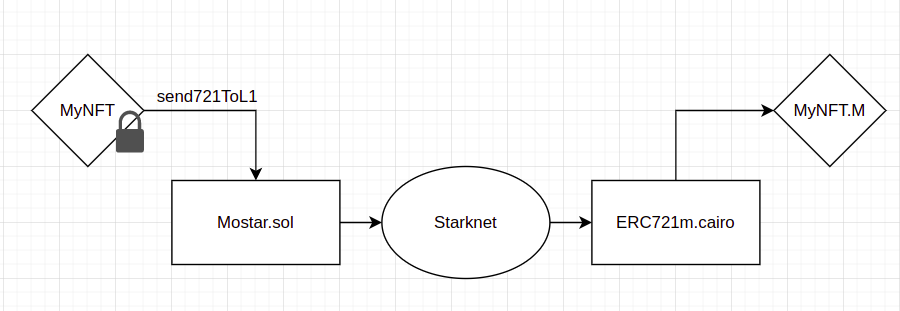
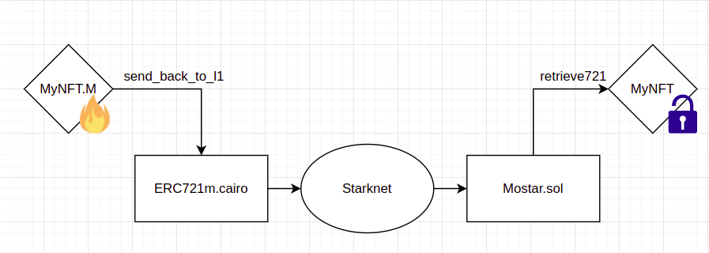

# Mostar
A multi-asset bridge between Ethereum and Starknet

## How does it work?

### Depositing Assets
 <br>
Original asset is locked on L1 contract and a new asset is minted on designated L2 contract.


### Retrieving Assets
 <br>
Asset on L2 is burned and a message to unlock L1 asset is sent. Asset then can be retrieved by calling retrieve function on L1

### Initialization
Since it is not possible to implement factory pattern on Cairo (yet), there is a "Initiator" role that deploys L2 contracts and registers addresses of these contracts to L1. A contract can only be initialized once and initialized contracts can be observed from outside, making the process a little bit more trustless.

## Contracts

```
contracts
├── cairo
│   └── ERC721m.cairo
├── mock
│   └── m_ERC721m.cairo
└── sol
    ├── DummyNFT.sol
    ├── IStarknetCore.sol
    └── MostarManager.sol
```

## TODO

- Add ERC1155 and ERC20 support
- Add cross-chain tests
